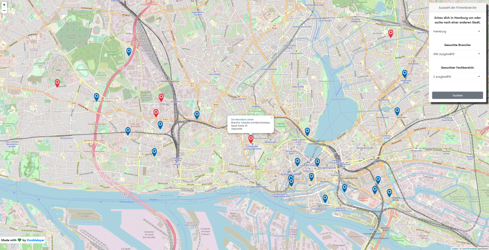

# German Company Map

- App detects users location (from browser or IP)
- A pin will be added to the map with the users location
- Guests of the website can search for companies based on city, sector and division input
- A pin for all found companies will be added to the map
- Pin is clickable an refers to the company webpage
- Includes two servers (client & api)



## Client :busts_in_silhouette:

- [written in react](https://reactjs.org/)
- [reactrap](https://reactstrap.github.io/) & [bootstrap](https://react-bootstrap.github.io/)
- [leaflet](https://leafletjs.com/)
  - Leaflet is the leading open-source JavaScript library for mobile-friendly interactive maps.
- [react-device-detect](https://www.npmjs.com/package/react-device-detect)
- [react-loading-overlay](https://www.npmjs.com/package/react-loading-overlay)
- [react-picky](https://www.npmjs.com/package/react-picky)
- [react-spinners](https://www.npmjs.com/package/react-spinners)

## Setup

```
npm install
```

## Development

```
npm start
```

---

## Server :computer:

Includes API Server utilities:

- [morgan](https://www.npmjs.com/package/morgan)
  - HTTP request logger middleware for node.js
- [helmet](https://www.npmjs.com/package/helmet)
  - Helmet helps you secure your Express apps by setting various HTTP headers. It's not a silver bullet, but it can help!
- [dotenv](https://www.npmjs.com/package/dotenv)
  - Dotenv is a zero-dependency module that loads environment variables from a `.env` file into `process.env`
- [cors](https://www.npmjs.com/package/cors)
  - CORS is a node.js package for providing a Connect/Express middleware that can be used to enable CORS with various options.

Development utilities:

- [nodemon](https://www.npmjs.com/package/nodemon)
  - nodemon is a tool that helps develop node.js based applications by automatically restarting the node application when file changes in the directory are detected.
- [eslint](https://www.npmjs.com/package/eslint)
  - ESLint is a tool for identifying and reporting on patterns found in ECMAScript/JavaScript code.
- [mocha](https://www.npmjs.com/package/mocha)
  - ☕️ Simple, flexible, fun JavaScript test framework for Node.js & The Browser ☕️
- [supertest](https://www.npmjs.com/package/supertest)
  - HTTP assertions made easy via superagent.
- [snyk](https://www.npmjs.com/package/snyk)
  - Snyk helps you find, fix and monitor known vulnerabilities in Node.js npm dependencies
- [mongodb](https://www.npmjs.com/package/mongodb)
  - The official MongoDB driver for Node.js. Provides a high-level API on top of mongodb-core that is meant for end users.

## Setup

```
npm install
```

## Lint

```
npm run lint
```

## Test

```
npm run test
```

## Development

```
npm run dev
```

## Package Audit with snyk

```
npm run audit
```
